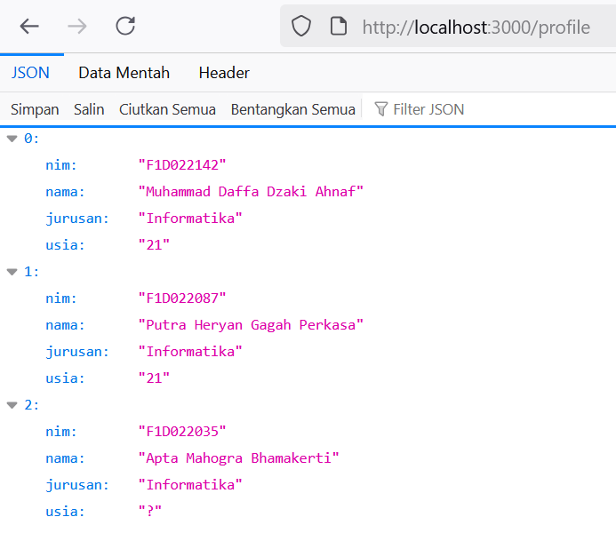

# week6-express-module
####
#### berikut adalah code program route/profile.js yang berguna mengatur logika routing untuk data profile supaya kode rapi dan mudah dikembangkan

####
#### berikut adalah code program utils/math.js untuk menyimpan fungsi-fungsi hitungan (tambah, kali, dll) supaya bisa dipakai berulang di file lain (index.js).

####
#### berikut code program index.js adalah tempat semua bagian dikumpulkan dan server dijalankan.

####
#### sebelum menjalankan browser, hal yang perlu dilakukan adalah menjalankan server terlebih dahulu melalui cmd dengan perintah "node index.js"

####
#### coba menjalankan http://localhost:3000/ di browser/Postman

####
#### coba menjalankan http://localhost:3000/hitung di browser/Postman

####
#### coba menjalankan http://localhost:3000/profile di browser/Postman

####
#### coba menjalankan http://localhost:3000/profile/F1D022142 di browser/Postman

